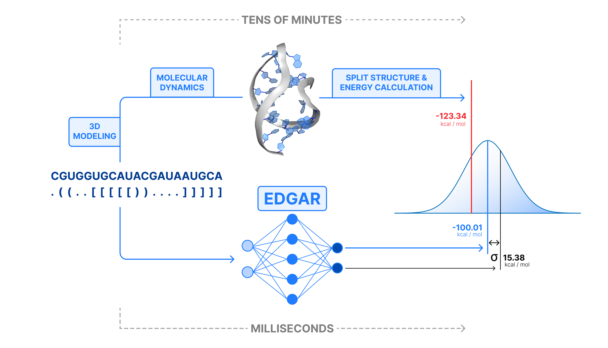

<h1>Edgar</h1>


Edgar is a deep learning based method for RNA and DNA folding energy prediction. The folding energy characterizes the stability of a nucleic acid with particular secondary structure, comprising energy of complementary bonds, long-range interaction and entropy of the system.
</br>


<h2>Installation</h2>

- Clone repository or download the archive:
	```
	git clone https://github.com/XELARI-CORP/Edgar.git
	cd Edgar
	```
    
- Create a virtual environment. It is recommended to use python version 3.8 or greater.

	- Using python venv:
	```
	python3 -m venv edgar
	. edgar/bin/activate
	```
	- Using conda:
	```
	conda create --name edgar python=3.10
	conda activate edgar
	```
- <a href="https://pytorch.org/get-started/locally/" target="_blank">Install PyTorch</a> compatible with your software (OS, GPU drivers).
- Install package:
	```
	pip install --upgrade pip
	pip install .
	```

<h2>Usage</h2>

By default Edgar runs on cpu, but you can select gpu inference and device name (default is 'cuda'). Pass nucleic acid in a DotBracket notation.
```
import edgar

Edgar = edgar.Model()
or
Edgar = edgar.Model(gpu=True, device="cuda:0")

result = Edgar.predict("AAACCCUUU", "(((...)))")

Predicted folding energy:
result.pred
>>> -9.897629296556886

Uncertainty of the prediction:
result.uncert
>>> -4.835448265075684

Maximum absolute prediction deviation:
result.div
>>> 32.00742884405733
```
Specify <b>na_type</b> argument ('rna' or 'dna') if it can not be derived from the sequence (sequence does not contain U or T nb).
```
result = Edgar.predict("GGGAAACCC", "(((...)))", na_type='rna')
result.pred
>>> -49.71087084083672
```
    
<h2>Train Edgar</h2>

We provide Edgar's training code in the <b>training</b> directory. You can repeat experiments or train the model on your data:
- Edit config in the <b>run.py</b> file. It provides the main settings for the training process.
    - <em>results_dir</em> - a directory for all your experiments (will be created automatically).
    - <em>experiment_name</em> - name of a directory for saving weights and log file (will be inside results_dir).
    - <em>train/valid_data</em> - path to the train and validation csv data files. It must contain the following columns: <b>seq</b> with na sequences, <b>struct</b> with na secondary structures in a DotBracket notation, <b>na_type</b> containing either 'rna' or 'dna' and column with target values.
    - <em>target_column</em> - name of a column in csv data files that indicates target values.
    - <em>device</em> - name of a device that will be used to train model.
    - <em>batch_size</em> - number of nucleic acids in each training batch.
    - <em>grad_acum</em> - number of batches to accumulate gradient before optimizer.step().
- Run <b>run.py</b> file, training will stop automatically when the patience criteria is met. If you want to rewrite an existing experiment, specify -f flag.
    ```
	python3 run.py [-f]
	```
- You can use your custom model by loading its weights:
	```
	Edgar = edgar.Model()
	Edgar.load_model("./results/experiment_1/weights.pth")
	```
